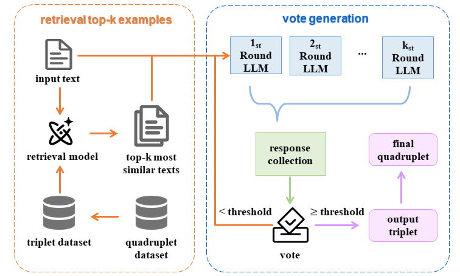
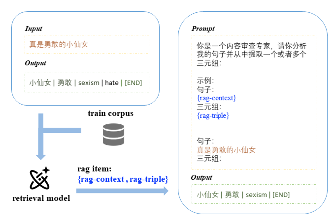
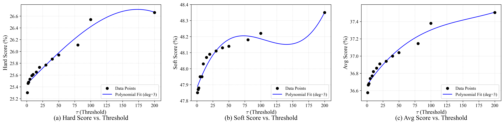

# 细粒度中文仇恨识别-\_KING\_

[English README](./readme_en.md)

本项目所使用方法在 [CCL25-Eval 任务10：细粒度中文仇恨识别评测](https://tianchi.aliyun.com/competition/entrance/532298) 中获得第二名的成绩，包含结果复现、技术报告及相关代码。  

感谢 CCL25-Eval 组委会提供平台和[STATE ToxiCN 论文](https://arxiv.org/abs/2501.15451) 开源高质量细粒度中文仇恨识别数据集。

## 目录

- [目录结构](#目录结构)
- [实验设置](#实验设置)
- [结果复现](#结果复现)
  - [训练](#训练)
  - [推理](#推理)
    - [部署](#部署)
    - [推理执行](#推理执行)
- [技术报告](#技术报告)
  - [问题转化](#问题转化)
  - [提示词设置](#提示词设置)
  - [自检索增强生成 (Self-Retrieval Augmented Generation, SRAG)](#自检索增强生成self-retrieval-augmented-generation-srag)
  - [多轮累积投票策略 (Multi-round Accumulative Voting, MAV)](#多轮累积投票策略multi-round-accumulative-voting-mav)
- [实验结果与分析](#实验结果与分析)
  - [实验结果](#实验结果)
  - [结果分析](#结果分析)
- [补充实验](#补充实验)
- [未来改进](#未来改进)  


## 目录结构
- code/
    - `tools.py` : 工具库，定义了使用到的部分函数
    - `get_prompt.py` : 定义了所使用的 prompt
    - `qwen_gen.py` : vllm部署qwen模型后，通过导入该文件快速调用模型, `qwen = QwenGen(port=, temperature=)`
    - `to_rag_train_data.py` : 通过RAG构造训练数据
    - `accumulated_inference_Integration.py` : 模型推理代码,最终结果使用的方法
    - `inference_Integration.py` : 模型推理代码（早期策略）
    - `train.sh` : 模型训练文件，基于LLaMA-Factory,需把`model_name_or_path`替换为本地`Qwen2___5-7B-Instruct`路径
    - `eval.py` : 本地自测结果的评估文件，无需关注
- data/
    - `output/` : 最终输出的 `.txt` 文件保存目录
    - `train.json` : 官方原始4000条训练数据
    - `test2.json` : 复赛测试集
    - `train_rag_triple.json` : 构造的RAG训练数据，格式为LLaMA-Factory所要求的数据格式
    - `dataset_info.json` : LLaMA-Factory训练所要求的数据说明文件
    - `ds_z2_config.json` : DeepSpeed 配置文件，无需关注
- models/
    - `Qwen2___5-7B-Instruct-traindata_train_rag_triple/full/sft/` : 最终训练得到的模型
    - `bge-large-zh-v1.5/` : 使用的检索模型

## 实验设置  

详细训练设置请参考 `train.sh` 文件。

- **硬件环境**: 4 × NVIDIA L40S 40G GPUs
- **训练框架**: LLaMA-Factory (训练), vLLM (推理)
- **基础库**: 标准 Python 深度学习库
- **基座模型**: Qwen2.5-7B-Instruct
- **检索模型**: bge-large-zh-v1.5
- **微调设置**:
  - 微调类型: 全参数微调
  - 数据集: `train_rag_triple.json`
  - 训练轮数: 2
  - 学习率: $1.0 \times 10^{-5}$ (余弦调度)
  - 批大小: 4 (每设备), 梯度累积步数: 4
  - 优化器: BF16 混合精度
  - 温度 (Temperature): 0.7
  - DeepSpeed: Zero-2 配置


## 结果复现   
主要包括模型训练和推理两部分。

### 训练
首先在`data/`目录生成 RAG 训练数据
```python
python to_rag_train_data.py
```
然后就可以直接训练模型。我用四张L40S训练了20分钟
```bash
bash train.sh train_rag_triple 0,1,2,3
```

### 推理
#### 部署
首先，使用 vLLM 部署模型。运行以下命令，将训练好的 `Qwen_7b` 模型部署到 35000 端口。  
**注意**:
- 模型路径 `--model=` 需与本地实际路径保持一致。
- `CUDA_VISIBLE_DEVICES="0,1"` 与 `--tensor-parallel-size=2` 的 GPU 数量应保持一致。
```bash
CUDA_VISIBLE_DEVICES="0,1" python -m vllm.entrypoints.openai.api_server --served-model-name default --model="CCL2025-final/models/Qwen2___5-7B-Instruct-traindata_train_rag_triple/full/sft" --trust-remote-code --tensor-parallel-size=2 --port="35000" --max_model_len 10000
```
#### 推理执行
推理过程在两张 L40S GPU 上大约需要五个小时完成。  

在`code/`目录下，运行
```bash
python accumulated_inference_Integration.py
```
在`data/output`目录下生成`test2.json`的推理结果  

**重要提示！！！**  
推理代码有概率会出现死循环，可以考虑设置最大重复次数，或者直接把这部分代码注释掉，应该不会显著影响结果：
可以把
```python
while not check_response(item['output']):
    item['output'] = process_triple(gen_output(item))
    print(item['output'])
```
改为：
```python
repeat = 10
for _ in range(repeat):
    if check_response(item['output']):
        break
    item['output'] = process_triple(gen_output(item))
```
或者直接注释掉应该也行

## 技术报告

该报告介绍了一种面向细粒度中文仇恨言论识别的高效方法，该方法在“CCL25-Eval 任务10：细粒度中文仇恨识别评测
”中取得了第二名的成绩。针对细粒度片段级中文仇恨言论识别的特点，我们通过数据分析将四元组（评论对象、论点、目标群体、是否仇恨）识别任务简化为三元组（评论对象、论点、目标群体）抽取问题，设计了利用训练集自身构建检索语料库的自检索增强生成（Self-Retrieval Augmented Generation, SRAG）框架，并开发了基于并行规模扩展（Parallel Scaling Law，PARSCALE）思想的多轮累积投票策略（Multi-round Accumulative Voting, MAV）。SRAG提供了有效的语境示例，而MAV策略进一步增强了输出的稳定性和准确性，实验结果显示，该方法取得了最高的 hard_score，平均分数位列第二，验证了所提方法在细粒度仇恨言论识别任务上的有效性与可靠性。此外，该方法具有良好的扩展性，能进一步提升预测结果并且可以迁移到其他NLP任务中。    

整体架构：  



### 问题转化
通过对训练数据的分析，我们观察到目标群体（Targeted Group）与是否仇恨（Hateful）这两个标签之间存在强相关性：当且仅当目标群体为"non-hate"时，是否仇恨才为标签"non-hate"，否则是否仇恨为"hate"。基于此发现，我们将原始的四元组识别问题简化为三元组（评论对象、论点、目标群体）的抽取任务。考虑到大型语言模型基于“next-token prediction”的生成机制，这种简化有助于提高模型的生成准确性和效率。

这部分主要用到两个关键函数：
1. 将四元组转化为三元组，用于构造训练数据
```python
def output2triple(text):
    triple = ''
    seqs = text.split(' [SEP] ')
    for seq in seqs:
        parts = seq.split(' | ')
        triple += f'{parts[0]} | {parts[1]} | {parts[2]} [SEP] '
    return triple[:-7] + ' [END]'
```
2. 将三元组恢复为四元组，用于处理模型输出
```python
def process_triple(output):
    res = ''
    try:
        assert output[-6:] == ' [END]'
        output = output[:-6]
        seqs = output.split(' [SEP] ')
        for seq in seqs:
            parts = seq.split(' | ')
            res += f'{parts[0]} | {parts[1]} | {parts[2]} | '
            hate_classes = parts[2].split(', ')
            hate = 'hate'
            for hate_class in hate_classes:
                if hate_class not in ['Racism', 'Region', 'LGBTQ', 'Sexism', 'others', 'non-hate']:
                    return ''
                if hate_class == 'non-hate':
                    hate = 'non-hate'
            res += f'{hate} [SEP] '
        res = res[:-7] + ' [END]'
        return res
    except:
        return ''
```

### 提示词设置
提示词（Prompt）的设计对大型语言模型的性能有重要影响。通过在`Qwen2.5_1.5B`模型上的测试，我们发现：

1. 语言选择：中文提示词显著优于英文提示词，这与数据集的语言特性（中文）相符。
2. 复杂度：简洁的提示词与包含复杂指令的提示词在效果上差异不大。考虑到后续微调的需求，我们最终选择了一种更简洁的提示词格式，以利于模型学习。

这里没下太多功夫，就是确保不拉分即可。

最终采用的提示词模板为：
```python
f'你是一个内容审查专家，请你分析我的句子并且从中提取出一个或者多个三元组:\n示例：\n### 句子：\n{retriver_item["content"]}\n### 三元组：\n{retriver_item["output"]}\n### 句子：\n{content}\n### 三元组：\n'
```


数据示例：  


### 自检索增强生成（Self-Retrieval Augmented Generation, SRAG）
检索增强生成（Retrieval-Augmented Generation, RAG）是一种通过从外部语料库检索相关信息来辅助模型生成的方法，已在多种自然语言处理任务中展现出显著效果。考虑到本任务的特殊性（难以从外部获取高度相关的仇恨言论样本，且细粒度生成本身具有挑战性等），我们提出了自检索增强生成（SRAG）方法。该方法将训练集本身作为检索语料库，为模型提供相似的已标注示例，以辅助其理解任务需求并生成符合格式的输出。
 
SRAG的核心思想是利用训练数据中的相似案例作为少样本学习（few-shot learning）的动态示例，从而引导模型更准确地理解任务需求和输出格式。与传统RAG不同，SRAG 无需依赖额外的外部数据资源，使其更适合特定领域的任务以及资源相对受限的研发环境。

具体实现上，我们使用`BAAI/bge-large-zh-v1.5`作为检索模型，在训练和推理阶段均采用这种方法，以确保一致性对齐。    

**主要代码：**   
首先加载检索模型，为训练集所有`content`生成嵌入向量
```python
data = get_json('../data/train.json')
texts = [item['content'] for item in data]
test2item = {}
for item in data:
    item['output'] = output2triple(item['output'])
    test2item[item['content']] = item

model_path="/data1/zlh/hfmodel/BAAI/bge-large-zh-v1.5"
print(f"正在从本地路径加载模型: {model_path}")
model = SentenceTransformer(model_path)
print("模型加载成功。")
corpus_embeddings = model.encode(texts, convert_to_tensor=True, show_progress_bar=True)
if corpus_embeddings.is_cuda:
    corpus_embeddings = corpus_embeddings.cpu()
corpus_embeddings_np = corpus_embeddings.numpy()
```
检索函数，从训练集检索与query最相近的k个文本
```python
def retriever(texts, query, top_k=1):
    query_embedding = model.encode(query, convert_to_tensor=True, show_progress_bar=False)

    # 将 PyTorch tensor 转换为 NumPy array，如果它们在 GPU 上，则移至 CPU
    if query_embedding.is_cuda:
        query_embedding = query_embedding.cpu()

    query_embedding_np = query_embedding.numpy().reshape(1, -1) # Reshape for cosine_similarity

    # 计算余弦相似度
    similarities = cosine_similarity(query_embedding_np, corpus_embeddings_np)[0]

    # 获取 top_k 个最相似的文本的索引
    if len(similarities) <= top_k:
        # 如果文本数量少于或等于 top_k，则返回所有文本（按相似度降序）
        top_k_indices = np.argsort(similarities)[::-1]
    else:
        # 获取相似度最高的 top_k 个索引
        top_k_indices = np.argsort(similarities)[-top_k:][::-1] # 从大到小排序

    # 返回最相关的文本
    retrieved_texts = [texts[idx] for idx in top_k_indices]
    
    return retrieved_texts
```  

**训练阶段**  
对每一个输入，检索出top-2相似的训练样本（排除自身）与输入拼接成prompt，做为新的训练数据
```python
train_data = []
for item in tqdm(data):
    retriver_content = retriever(texts, item['content'], top_k=2)[1]
    retriver_item = test2item[retriver_content]
    train_data.append({
        'instruction': '',
        'input' : generate_rag_prompt(item['content'], retriver_item, 'triple'),
        'output' : item['output']
    })
```

**推理阶段**  
对于每个输入数据，调用`retriever`函数获取$top-k（k=10）$相似数据，然后使用MAV策略得到输出。

###  多轮累积投票策略（Multi-round Accumulative Voting, MAV）
计算规模是提升深度学习模型性能的关键因素之一，这不仅体现在训练阶段，也适用于推理过程。 [并行规模扩展（Parallel Scaling Law, PARSCALE）](https://arxiv.org/abs/2505.10475) 是一种通过在推理阶段增加计算资源投入来提升模型表现的思路，无需重新训练或改变模型参数。PARSCALE的核心思想是：在固定模型参数的条件下，通过对输入应用多样化变换生成多个变体，并行推理后使用可学习参数进行结果聚合，以获得更高质量的输出。

受PARSCALE并行处理多样化输入的启发，我们提出了多轮累积投票（MultiRound Accumulative Voting, MAV）作为细粒度中文仇恨言论识别任务的创新适应方法，通过SRAG检索的示例生成多样化提示，并通过投票机制选择最优的三元组输出。 

这种方法有几个显著优势：

1. **成本效益高：** 与增加模型参数或重新训练相比，MAV只需在推理阶段增加计算资源。
2. **灵活可调：** 可以根据实际需求和可用资源限制，动态调整推理时的计算量。  
3. **易于实现：** 无需修改模型结构或重新训练，实现简单且可靠。

**具体实现策略**：对于每个输入文本，首先检索出多个（top-K）语义相似的训练样本。然后，将每个检索到的样本分别与输入文本组合，构建 K 个不同的提示（prompts），并让模型对这 K 个提示进行并行推理。迭代这个过程并累积统计生成结果，当某一结果的出现频次达到预设阈值时，将其作为最终输出。这种方法能够有效减少模型输出的随机性波动，从而提高结果的稳定性和整体准确性。  

具体实现如下：
```python
# accumulated_inference_Integration.py
integration_num = 10
threshold = 50

def gen_output(item):
    all_responses = []
    while True:
        retriver_contents = retriever(texts, item['content'], top_k=integration_num)
        for retriver_content in retriver_contents:
            retriver_item = test2item[retriver_content]
            prompt = generate_rag_prompt(item['content'], retriver_item, 'triple')
            result = qwen.response(prompt)
            all_responses.append(result)

        response_counts = Counter(all_responses)
        most_common_list = response_counts.most_common(1)
        actual_most_common_response = most_common_list[0][0]
        count_of_most_common = most_common_list[0][1]

        if count_of_most_common >= threshold:
            return actual_most_common_response
```
在推理阶段，我们设置temperature=0.1，既保证输出具有较高的置信度，同时维持一定的输出多样性。设置integration_num=10（每轮检索的相似样本数）和threshold=50（累积投票的频次阈值）。

`inference_Integration.py`是我最初的策略，采用单轮投票的方法，但是局限性很强，因为threshold过高会出现一直得不到结果的情况。  
`accumulated_inference_Integration.py`采用多轮累积投票策略，是最终效果最好的策略。

### 实验结果与分析

####  实验结果
我一共提交了三个版本的结果进行评测，
1. 单轮投票策略（integration_num=5，threshold=2）：得分0.3569
2. 单轮投票策略（integration_num=5，threshold=3）：得分0.3576
3. 多轮累积投票策略（MAV）（integration_num=10，threshold=30）：得分0.3636
>实验基于训练后的`Qwen2___5-7B-Instruct-traindata_train_rag_triple`模型  

#### 结果分析
- 实验结果表明所采用的两种推理策略均能显著提升结果，选择合适的方法和参数能根据现有资源更好地发挥模型性能
- MAV策略效果最佳，并且应该尚未达到性能上限，进一步优化参数或增加计算轮次可能带来持续提升
- 对于MAV方法，推测最终结果与投票阈值(threshold)应该会满足渐进增长曲线（需进一步详细实验验证）
- 可扩展性强：阈值和检索数量等参数可以灵活调整，使得该策略在不同计算资源条件下都能提升模型性能   

**模型训练提供基础能力，而推理策略则通过增加适量计算开销进一步释放模型潜力，两者相辅相成。**

### 补充实验
这部分实验基于 [STATE ToxiCN](https://arxiv.org/abs/2501.15451) 论文中的数据集，与比赛评估数据集不同，但能反映大致效果。  
#### MAV 参数敏感性分析

  
thresholds = [1, 2, 3, 5, 8, 10, 15, 20, 30, 40, 50, 80, 100, 200] 

结果表明更高的投票阈值会带来更好的性能，hard score 提升最为显著，这与复赛排名结果一致（我们取得了最高的hard score）。同时也进一步说明了 MAV 的巨大潜力。

#### 消融实验


Base Model 基于普通 SFT 得到。

### 未来改进

- 写报告时突然想到的，或许可以采用类似强化学习的`ε-greedy`探索策略，而不是只是简单使用top_k，提供一定概率检索不相关数据，增加输出多样性
- 更多超参数探究
- 其他