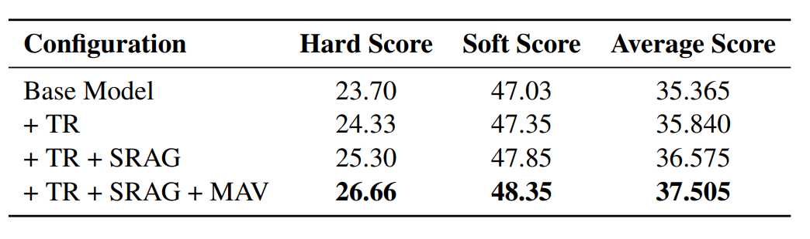

# Fine-Grained Chinese Hate Speech Recognition - KING

[中文 README](./readme.md)

This repository contains the implementation, technical report, and resources for our system, which achieved second place in the [CCL25-Eval Task 10: Fine-Grained Chinese Hate Speech Recognition](https://tianchi.aliyun.com/competition/entrance/532298). The system includes code for result reproduction, a detailed technical report, and related resources.

We express our gratitude to the CCL25-Eval organizers for providing the evaluation platform and to the authors of the [STATE ToxiCN paper](https://arxiv.org/abs/2501.15451)  for open-sourcing a high-quality fine-grained Chinese hate speech dataset.

## Table of Contents

- [Repository Structure](#repository-structure)
- [Experimental Setup](#experimental-setup)
- [Result Reproduction](#result-reproduction)
  - [Training](#training)
  - [Inference](#inference)
    - [Model Deployment](#model-deployment)
    - [Inference Execution](#inference-execution)
- [Technical Report](#technical-report)
  - [Task Reformulation](#task-reformulation)
  - [Prompt Design](#prompt-design)
  - [Self-Retrieval-Augmented Generation (SRAG)](#self-retrieval-augmented-generation-srag)
  - [Multi-Round Accumulative Voting (MAV)](#multi-round-accumulative-voting-mav)
- [Experimental Results and Analysis](#experimental-results-and-analysis)
  - [Results](#results)
  - [Analysis](#analysis)
- [Supplementary Experiments](#supplementary-experiments)
- [Future Improvements](#future-improvements)

## Repository Structure

- `code/`:
  - `tools.py`: Utility functions used in the project.
  - `get_prompt.py`: Defines the prompt templates used for generation.
  - `qwen_gen.py`: Facilitates quick model invocation after deploying Qwen with vLLM, e.g., `qwen = QwenGen(port=, temperature=)`.
  - `to_rag_train_data.py`: Constructs training data using Retrieval-Augmented Generation (RAG).
  - `accumulated_inference_Integration.py`: Inference code implementing the final Multi-Round Accumulative Voting (MAV) strategy.
  - `inference_Integration.py`: Inference code for the earlier single-round voting strategy.
  - `train.sh`: Training script based on LLaMA-Factory; replace `model_name_or_path` with the local path to `Qwen2.5-7B-Instruct`.
  - `eval.py`: Local evaluation script for self-testing (optional, can be ignored).
- `data/`:
  - `output/`: Directory for storing final `.txt` output files.
  - `train.json`: Official training dataset with 4,000 samples.
  - `test2.json`: Test set for the second evaluation phase.
  - `train_rag_triple.json`: RAG-augmented training data in the format required by LLaMA-Factory.
  - `dataset_info.json`: Metadata file required for LLaMA-Factory training.
  - `ds_z2_config.json`: DeepSpeed configuration file (optional, can be ignored).
- `models/`:
  - `Qwen2___5-7B-Instruct-traindata_train_rag_triple/full/sft/`: Final trained model.
  - `bge-large-zh-v1.5/`: Retrieval model used for SRAG.

## Experimental Setup

Refer to the `train.sh` file for detailed training configurations.

- **Hardware**: 4 × NVIDIA L40S 40GB GPUs
- **Frameworks**: LLaMA-Factory (training), vLLM (inference)
- **Base Libraries**: Standard Python deep learning libraries
- **Base Model**: Qwen2.5-7B-Instruct
- **Retrieval Model**: bge-large-zh-v1.5
- **Fine-Tuning Settings**:
  - Fine-Tuning Type: Full-parameter fine-tuning
  - Dataset: `train_rag_triple.json`
  - Epochs: 2
  - Learning Rate: $1.0 \times 10^{-5}$ (cosine scheduler)
  - Batch Size: 4 (per device), Gradient Accumulation Steps: 4
  - Optimizer: BF16 mixed precision
  - Temperature: 0.7
  - DeepSpeed: Zero-2 configuration

## Result Reproduction

The reproduction process consists of two main steps: training and inference.

### Training

1. Generate RAG-augmented training data in the `data/` directory:

   ```bash
   python to_rag_train_data.py
   ```

2. Train the model using four L40S GPUs (approximately 20 minutes):

   ```bash
   bash train.sh train_rag_triple 0,1,2,3
   ```

### Inference

#### Model Deployment

Deploy the trained `Qwen2.5-7B-Instruct` model using vLLM on port 35000:

```bash
CUDA_VISIBLE_DEVICES="0,1" python -m vllm.entrypoints.openai.api_server --served-model-name default --model="CCL2025-final/models/Qwen2___5-7B-Instruct-traindata_train_rag_triple/full/sft" --trust-remote-code --tensor-parallel-size=2 --port="35000" --max_model_len 10000
```

**Notes**:

- Ensure the `--model=` path matches the local model directory.
- The number of GPUs in `CUDA_VISIBLE_DEVICES` (e.g., "0,1") must match `--tensor-parallel-size` (e.g., 2).

#### Inference Execution

Inference takes approximately five hours on two L40S GPUs. Run the following in the `code/` directory:

```bash
python accumulated_inference_Integration.py
```

This generates inference results for `test2.json` in the `data/output/` directory.

**Important Note**:
The inference code may encounter an infinite loop. To mitigate this, consider setting a maximum number of iterations or commenting out the loop. This should not significantly impact results. Modify:

```python
while not check_response(item['output']):
    item['output'] = process_triple(gen_output(item))
    print(item['output'])
```

to:

```python
repeat = 10
for _ in range(repeat):
    if check_response(item['output']):
        break
    item['output'] = process_triple(gen_output(item))
```

Alternatively, comment out the loop entirely.

## Technical Report

This report presents an effective approach for Fine-Grained Chinese Hate Speech Recognition (FGCHSR), achieving second place in CCL25-Eval Task 10. To address the challenges of fine-grained, span-level hate speech recognition, we reformulated the quadruplet extraction task (Target, Argument, Targeted Group, Hatefulness) into a triplet extraction task (Target, Argument, Targeted Group) through data analysis. We developed a Self-Retrieval-Augmented Generation (SRAG) framework that leverages the training set as a retrieval corpus and introduced a Multi-Round Accumulative Voting (MAV) strategy inspired by the Parallel Scaling Law (PARSCALE). SRAG provides contextually relevant examples, while MAV enhances output stability and accuracy. Experimental results demonstrate that our approach achieved the highest Hard Score and the second-highest Average Score, validating its effectiveness and robustness for FGCHSR. Furthermore, the method is highly extensible, with potential for further performance improvements and applicability to other NLP tasks.

**System Architecture**:


### Task Reformulation

Analysis of the training data revealed a strong correlation between the Targeted Group and Hatefulness labels: Hatefulness is labeled as "non-hate" only when the Targeted Group is "non-hate"; otherwise, it is "hate." Based on this observation, we reformulated the quadruplet extraction task into a triplet extraction task (Target, Argument, Targeted Group). This simplification leverages the next-token prediction mechanism of large language models, improving generation accuracy and efficiency.

Key functions:

1. Convert quadruplets to triplets for training data construction:

   ```python
   def output2triple(text):
       triple = ''
       seqs = text.split(' [SEP] ')
       for seq in seqs:
           parts = seq.split(' | ')
           triple += f'{parts[0]} | {parts[1]} | {parts[2]} [SEP] '
       return triple[:-7] + ' [END]'
   ```

2. Convert triplets back to quadruplets for processing model outputs:

   ```python
   def process_triple(output):
       res = ''
       try:
           assert output[-6:] == ' [END]'
           output = output[:-6]
           seqs = output.split(' [SEP] ')
           for seq in seqs:
               parts = seq.split(' | ')
               res += f'{parts[0]} | {parts[1]} | {parts[2]} | '
               hate_classes = parts[2].split(', ')
               hate = 'hate'
               for hate_class in hate_classes:
                   if hate_class not in ['Racism', 'Region', 'LGBTQ', 'Sexism', 'others', 'non-hate']:
                       return ''
                   if hate_class == 'non-hate':
                       hate = 'non-hate'
               res += f'{hate} [SEP] '
           res = res[:-7] + ' [END]'
           return res
       except:
           return ''
   ```

### Prompt Design

Prompt design significantly impacts the performance of large language models. Through experiments with the `Qwen2.5-1.5B` model, we found:

1. **Language Choice**: Chinese prompts outperformed English prompts, aligning with the dataset’s language characteristics.
2. **Complexity**: Simple prompts performed comparably to complex ones. To facilitate fine-tuning, we adopted a concise prompt format.

The final prompt template:

```python
f'You are a content moderation expert. Please analyze the sentence and extract one or more triplets:\nExample:\n### Sentence:\n{retriver_item["content"]}\n### Triplet:\n{retriver_item["output"]}\n### Sentence:\n{content}\n### Triplet:\n'
```

**Data Example**:


### Self-Retrieval-Augmented Generation (SRAG)

Retrieval-Augmented Generation (RAG) enhances model generation by retrieving relevant information from an external corpus, proving effective in various NLP tasks. Given the challenges of FGCHSR (e.g., limited availability of high-quality external hate speech data and the complexity of fine-grained generation), we proposed Self-Retrieval-Augmented Generation (SRAG). SRAG uses the training set as the retrieval corpus, providing semantically similar annotated examples to guide the model in understanding task requirements and generating compliant outputs.

SRAG leverages similar examples for dynamic few-shot learning, improving task comprehension and output accuracy without relying on external resources. This makes it well-suited for domain-specific tasks and resource-constrained environments.

**Implementation**:
We used `BAAI/bge-large-zh-v1.5` as the retrieval model for consistency across training and inference.

- Load the retrieval model and generate embeddings for all training set `content`:

  ```python
  data = get_json('../data/train.json')
  texts = [item['content'] for item in data]
  test2item = {}
  for item in data:
      item['output'] = output2triple(item['output'])
      test2item[item['content']] = item
  
  model_path="/data1/zlh/hfmodel/BAAI/bge-large-zh-v1.5"
  print(f"Loading model from local path: {model_path}")
  model = SentenceTransformer(model_path)
  print("Model loaded successfully.")
  corpus_embeddings = model.encode(texts, convert_to_tensor=True, show_progress_bar=True)
  if corpus_embeddings.is_cuda:
      corpus_embeddings = corpus_embeddings.cpu()
  corpus_embeddings_np = corpus_embeddings.numpy()
  ```

- Retrieve the top-$k$ most similar texts:

  ```python
  def retriever(texts, query, top_k=1):
      query_embedding = model.encode(query, convert_to_tensor=True, show_progress_bar=False)
      if query_embedding.is_cuda:
          query_embedding = query_embedding.cpu()
      query_embedding_np = query_embedding.numpy().reshape(1, -1)
      similarities = cosine_similarity(query_embedding_np, corpus_embeddings_np)[0]
      if len(similarities) <= top_k:
          top_k_indices = np.argsort(similarities)[::-1]
      else:
          top_k_indices = np.argsort(similarities)[-top_k:][::-1]
      retrieved_texts = [texts[idx] for idx in top_k_indices]
      return retrieved_texts
  ```

- **Training Phase**: For each input, retrieve the top-2 similar samples (excluding the input itself) and concatenate them with the input to form a prompt for new training data:

  ```python
  train_data = []
  for item in tqdm(data):
      retriver_content = retriever(texts, item['content'], top_k=2)[1]
      retriver_item = test2item[retriver_content]
      train_data.append({
          'instruction': '',
          'input': generate_rag_prompt(item['content'], retriver_item, 'triple'),
          'output': item['output']
      })
  ```

- **Inference Phase**: Retrieve the top-$k$ ($k=10$) similar samples and use MAV to generate the output.

### Multi-Round Accumulative Voting (MAV)

Computational scale is critical for enhancing deep learning model performance, not only during training but also in inference. The [Parallel Scaling Law (PARSCALE)](https://arxiv.org/abs/2505.10475) demonstrates that increasing computational resources during inference can improve performance without retraining or modifying model parameters. PARSCALE generates multiple input variants through diverse transformations, performs parallel inference, and aggregates results using learnable parameters to produce higher-quality outputs.

Inspired by PARSCALE, we introduced Multi-Round Accumulative Voting (MAV) for FGCHSR. MAV generates diverse prompts using SRAG-retrieved examples and selects the optimal triplet output through a voting mechanism.

**Advantages**:

1. **Cost-Effectiveness**: MAV requires only additional inference-time resources, avoiding retraining or parameter adjustments.
2. **Flexibility**: The computational load can be adjusted dynamically based on available resources.
3. **Ease of Implementation**: Simple and reliable, requiring no changes to the model architecture.

**Implementation**:
For each input text, retrieve the top-$k$ semantically similar samples, construct $k$ prompts, and perform iterative inference until the most frequent triplet exceeds a frequency threshold $\tau$. This reduces output randomness and enhances stability and accuracy.

**Code**:

```python
# accumulated_inference_Integration.py
integration_num = 10
threshold = 50

def gen_output(item):
    all_responses = []
    while True:
        retriver_contents = retriever(texts, item['content'], top_k=integration_num)
        for retriver_content in retriver_contents:
            retriver_item = test2item[retriver_content]
            prompt = generate_rag_prompt(item['content'], retriver_item, 'triple')
            result = qwen.response(prompt)
            all_responses.append(result)
        response_counts = Counter(all_responses)
        most_common_list = response_counts.most_common(1)
        actual_most_common_response = most_common_list[0][0]
        count_of_most_common = most_common_list[0][1]
        if count_of_most_common >= threshold:
            return actual_most_common_response
```

During inference, we set `temperature=0.1` to balance output confidence and diversity, with `integration_num=10` (number of retrieved samples per round) and `threshold=50` (frequency threshold).

The earlier `inference_Integration.py` used single-round voting, which was limited by potential failure to reach high thresholds. The `accumulated_inference_Integration.py` with MAV proved more effective.

### Experimental Results and Analysis

#### Results

We submitted three versions for evaluation:

1. Single-round voting (integration_num=5, threshold=2): Score 0.3569
2. Single-round voting (integration_num=5, threshold=3): Score 0.3576
3. Multi-round Accumulative Voting (MAV) (integration_num=10, threshold=30): Score 0.3636

> Experiments were conducted with the trained `Qwen2___5-7B-Instruct-traindata_train_rag_triple` model.

#### Analysis

- Both inference strategies significantly improved performance, with appropriate methods and parameters optimizing resource utilization.
- MAV achieved the best results, likely not yet reaching its performance ceiling, suggesting potential for further improvement with optimized parameters or additional iterations.
- For MAV, performance likely follows an asymptotic growth curve with respect to the voting threshold (pending further validation).
- The approach is highly extensible, with adjustable parameters like threshold and retrieval count, enabling performance improvements under varying computational constraints.

**Model training provides foundational capabilities, while inference strategies further unleash the model’s potential by introducing moderate computational overhead, with the two complementing each other.**

### Supplementary Experiments

These experiments were conducted on the [STATE ToxiCN](https://arxiv.org/abs/2501.15451) dataset, distinct from the competition dataset but indicative of general performance.

#### MAV Parameter Sensitivity Analysis


Thresholds tested: [1, 2, 3, 5, 8, 10, 15, 20, 30, 40, 50, 80, 100, 200]

Higher thresholds improved performance, particularly the Hard Score, consistent with our top Hard Score in the competition. This underscores MAV’s potential.

#### Ablation Study


The baseline model was obtained via standard Supervised Fine-Tuning (SFT).

### Future Improvements

- Incorporate an ε-greedy exploration strategy, inspired by reinforcement learning, to introduce randomness in retrieval (beyond top-$k$) for increased output diversity.
- Explore additional hyperparameters to further optimize performance.
- Investigate other enhancements, such as cross-domain transfer or multimodal approaches.